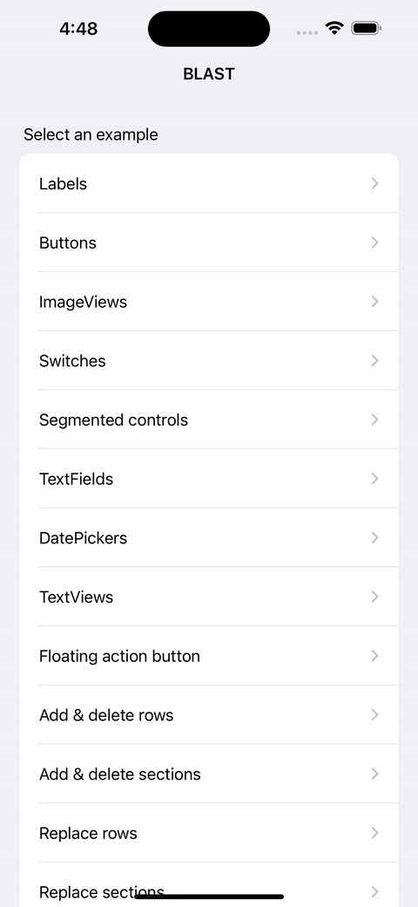

# Blast
========

## What is it?
Blast is the evolved Swift version of Blaze, the Objective-C framework to speed up app development.
[See the medium-article here!](https://medium.com/@graafict/blaze-fast-flexible-and-awesome-3a7a73374de7#.20gp2rll3)

## Register cells
The BlastController requires you to register all your headers/footers & cells.
You could do this lazily but if it reloads before you did the App wil crash, so you can run into issues with if you're not careful. Registering cells is not computationally expensive so it's best practice to simply register all possible XIBs in viewDidLoad.

## Styling
Do all the styling inside XIBs. The old Blaze (Objective-C) supported more styling things like selectionStyle but everything became too bloated with the thousand options, and since using the InterfaceBuilder is the entire idea of this framework, you should style it in there as much as possible. If you need two almost exactly the same kind of cells, simply copy it, style the one thing that's different, give it a different name, and you're done!

## XIB & modules
Uncheck the 'Inherit Module From Target' and set the Module to 'Blast', otherwise it won't recognize the BlastCell

## Lazy sections
You can create rows & sections lazily, which is cleaner if you're not sure some rows or sections are needed. But if you use it for sections, then you need to be sure the sections will be retained.

## ImageViews
Since the image is unknown, it's best practice to put it inside a UIView and set hard constraints for width & height. If you don't, it will base it on the image view/height, but with aspect-fit and stuff like it usually breaks things and get constraint-warnings. 'Trust me, it makes things easier. Btw, you can still get stupid consolepwarnings because the contentView of a cell is always 0.3 higher. So if you set a hard height=200, it will show the warning. It will still work well, but if you want the warning to disappear, set the bottom constraint priority to 999. It will behave exactly the same, but no more warnings.

## Empty state view
Blaze had a special EmptyStateView, but it was prone to errors. With the new better methods to replace sections & rows with animations, it's better to simply create an EmptyStateCell (and/or header) and use that to show an empty state.

## Example project
There's much more to tell you and I could explain all the possibilities of the framework in text, but the code truly speaks for itself.
Open the example project, and you'll see all the options for each possibility:
- Labels
- Buttons
- ImageViews
- Switches
- SegmentedControls
- TextFields
- DatePickers
- TextViews
- FloatingActioButton
- Add/delete rows
- Add/delete sections
- Replace rows
- Replace sections
- Reload rows/sections

